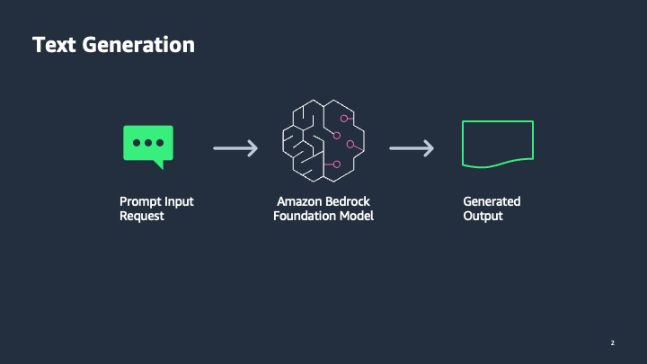

# Lab 1 - Text Generation

## Overview

In this lab, you will learn how to generate text using LLMs on Amazon Bedrock by using the Bedrock API. 

We will first generate text using a zero-shot prompt. The zero-shot prompt provides instruction to generate text content without providing a detailed context. We will explore zero-shot email generation using Bedrock API (BoTo3). Then we will show how to improve the quality of the generated text by providing additional context in the prompt. Additionally, we will also look at text summarization, name entity recognition, and code generation examples.

## Audience

Architects, data scientists, and developer who want to learn how to use Amazon Bedrock LLMs to generate text. 
Some of the business use cases for text generation include:

- Generating product descriptions based on product features and benefits for marketing teams
- Generation of media articles and marketing campaigns
- Email and reports generation
- Code Translation, code explain and reviews

## Workshop Notebooks

We will generate an email response to a customer where the customer had provided negative feedback on service received from a customer support engineer. The text generation workshop includes the following three notebooks. 
1. [Generate Email with Amazon Titan](./00_text_generation_w_bedrock.ipynb) - Invokes Amazon Titan large text model using Bedrock API to generate an email response to a customer. It uses a zero-shot prompt without context as instruction to the model. 
2. [Zero-shot Text Generation with Anthropic Claude](01_code_generatation_w_bedrock.ipynb) - Invokes Anthropic's Claude Text model using Bedrock API to generate Python code using Natural language. It shows examples of prompting to generate simple functions, classes, and full programs in Python for Data Analyst to perform sales analysis on a given Sales CSV dataset.
3. [Text summarization with Amazon Titan and Anthropic Claude](./02_text-summarization-titan+claude.ipynb) - Invoke Amazon Titan large text model and Anthropic's Claude Text model using Bedrock API to generate summary of provided text.
4. [Question and answers with Bedrock using Amazon Titan](./03_qa_with_bedrock_titan.ipynb) - Invoke Amazon Titan large text model to answer questions using models knowledge, check an example of hallucination, and using prompt engineering to address hallcination.
5. [Entity Extraction with Anthropic Claude](./04_entity_extraction.ipynb) - Invoke Anthropic's Claude Text model to extract name of book from a given email text.

## Setup
Before running any of the labs in this section ensure you've run the [Bedrock boto3 setup notebook](../00_Prerequisites/bedrock_basics.ipynb#Prerequisites).

## Architecture

